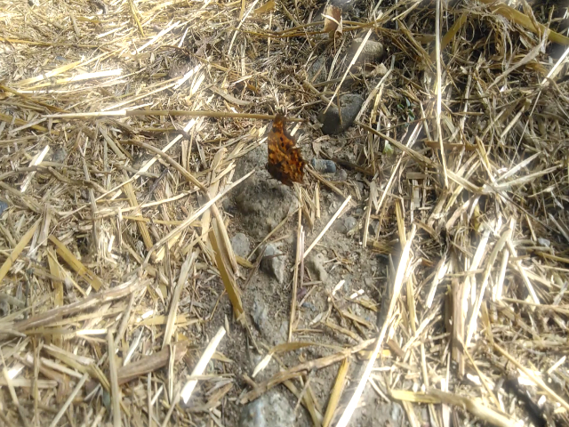
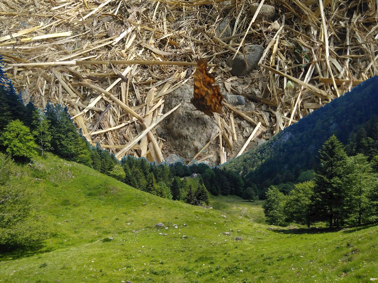

# Wvr example projects
Repository holding examples of projects using the differents features of [wvr](https://github.com/gurkeclub/wvr).

Running the examples can be done with the following command:
```
wvr -c EXAMPLE_NAME/config.ron
```

## Examples summary

### [bloom](bloom/)
This project applies a fast bloom on a video specified in the [bloom configuration file](bloom/config.ron).



### [cam](cam)
This project captures frames from the video input specified in the configuration file and composes them with the pictures specified in the configuration.

_Note 1: the default camera input will be used on Windows_

### [midi](midi)
This project captures displays the buttons pressed as well as the value of the different controls for the midi device specified in the configuration file.

### [simple](simple)
This project captures frames from a video and composes them with a landscape by extracting the sky regions.

